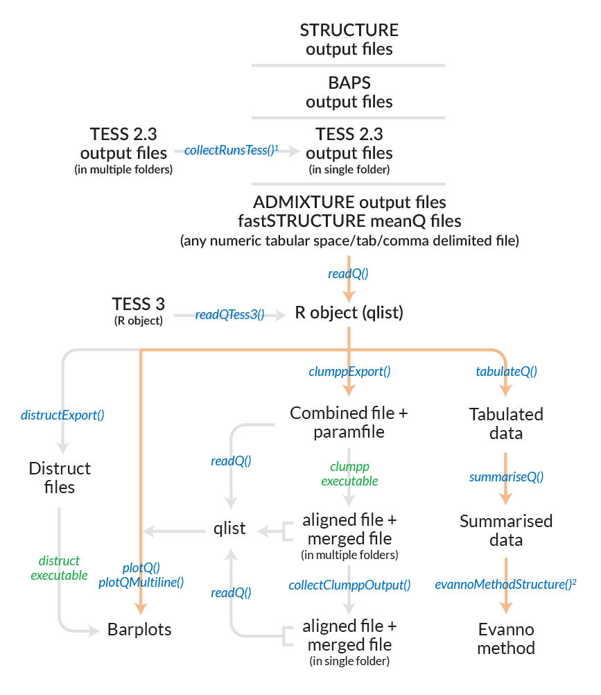
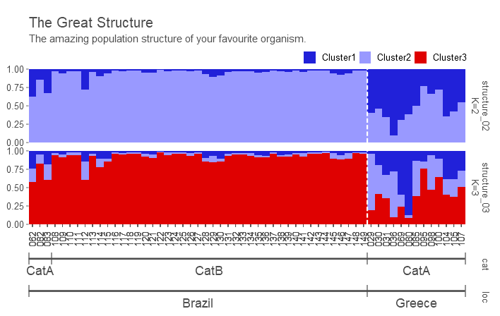

# pophelper 2.2.2

`pophelper` is an R package and web app to analyse and visualise population structure. `pophelper` curently supports output run files generated from population analysis programs such as STRUCTURE, TESS and numeric delimited formats such as ADMIXTURE or fastSTRUCTURE. The `pophelper` package can be used to read run files to R, tabulate runs, summarise runs, estimate *K* using the Evanno method, align clusters within K using CLUMPP, export files for DISTRUCT and generate barplot figures.  

For a detailed demonstration and walkthrough, refer the online [vignette](http://royfrancis.github.io/pophelper/). New versions and updates are shown only on this GitHub page.

## Latest version

`ggplot2` version must be 2.2.0 or above. Changes in the latest version `pophelper 2.2.2` compared to the previous stable version `pophelper 2.2.0` are listed below:

+ Changes in the order of arguments in `plotQ()` and `plotQMultiline()`
+ The border size and border colour of bars can be adjusted in `plotQ()` and `plotQMultiline()`
+ Titles and subtitles can be added and adjusted in `plotQ()` and `plotQMultiline()`
+ Spacing between plot and individual labels can be adjusted in `plotQ()` and `plotQMultiline()`
+ Strip panel label angle can be adjusted in `plotQ()`

For full detailed list of changes, refer to the [NEWS](https://github.com/royfrancis/pophelper/blob/master/NEWS).

## Installation  
You need to have R (> 3.3.0) statistical package installed on your system. [R](https://www.r-project.org/) is open-source and freely available to download for Windows, Mac and other OS. Then, install the dependency packages. Then, you can install `pophelper` from `github` using the `devtools` package.  

```coffee
# install dependencies and devtools
install.packages(c("Cairo","ggplot2","gridExtra","gtable","tidyr","devtools"),dependencies=T)

# install pophelper package from GitHub
devtools::install_github('royfrancis/pophelper')

# load library for use
library(pophelper)
```

Note that `pophelper 1.2.0` and later includes binary executables for CLUMPP and DISTRUCT. This is experimental and may not work on all OS and versions.

`pophelper 2.2.1` has been tested on the following systems: 

+ Windows 10 64bit, R 3.3.3
+ Windows 7 64bit, R 3.4.0 (DISTRUCT is unstable)
+ Scientific Linux 6.8 (Carbon) 64bit, R 3.4.0

## Web App   
An online interactive version of pophelper is available at [pophelper.com](http://www.pophelper.com). The web app is quite outdated and limited in terms of functionality and flexibility. The web app must not be used for major work or large datasets. The web app is also limited in computational power and working hours. The web app will be automatically restricted after 100 hours of use per month. If anyone has ideas for funding `pophelper` web server, please get in touch.  

## List of Functions  

For help on any function, use  
`?tabulateQ`  
`?evannoMethodStructure`  

```coffee
readQ()                   # Read q-matrix run files to R qlist
tabulateQ()               # Tabulate a qlist
summariseQ()              # Summarise an output from tabulateQ()
clumppExport()            # Generate CLUMPP input/output files
collectClumppOutput()     # Collect CLUMPP output into a common directory
plotQ()                   # Create single-line barplots from qlist
PlotQMultiline()          # Create multi-line barplots from qlist
distructExport()          # Export files for DISTRUCT from qlist

evannoMethodStructure()   # Perform the Evanno method for STRUCTURE data
collectRunsTess()         # Collect TESS output from multiple directories into one

analyseQ()                # A wrapper function to quickly tabulate, summarise, 
                          # perform evanno method, clumpp output and generate
                          # barplots from filenames/paths.
```

## Sample figures

  
__Fig:__ *Workflow for all filetypes.*  

  
__Fig:__ *Plots from Evanno method.*  

  
__Fig:__ *Singleline barplots from q-matrices with individual and group labelling.*  

  
__Fig:__ *Multiline barplots from q-matrices with individual and group labelling.* 

For detailed demonstration and description, refer the [vignette](http://royfrancis.github.io/pophelper/).

### Disclaimer

The `pophelper` R package is offered free and without warranty of any kind, either expressed or implied. I will not be held liable to you for any damage arising out of the use, modification or inability to use this program. `pophelper` R package can be used, redistributed and/or modified freely for non-commercial purposes subject to the original source being properly cited. Licensed under GPL-3. Please make sure you verify all your results.  

### Contact

If you have an comments, suggestions, corrections or ideas on ways to improve or extend this package, feel free to contact me. Submit a report on the [Github issues page](https://github.com/royfrancis/pophelper/issues).  

2017 Roy M Francis  
